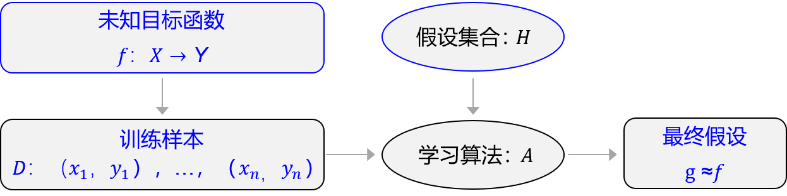
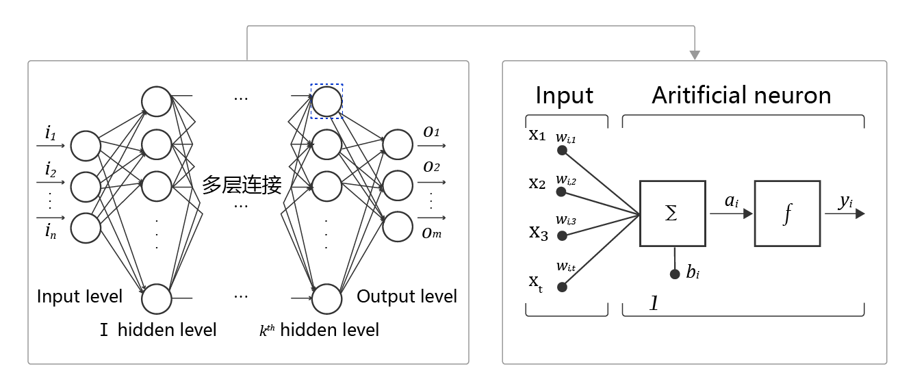

# 机器学习和深度学习综述

## 1. 人工智能、机器学习、深度学习的关系

近些年人工智能、机器学习和深度学习的概念十分火热，但很多从业者却很难说清它们之间的关系，外行人更是雾里看花。在研究深度学习之前，先从三个概念的正本清源开始。概括来说，人工智能、机器学习和深度学习覆盖的技术范畴是逐层递减的，三者的关系如 **图1** 所示，即：人工智能 > 机器学习 > 深度学习。

图1：人工智能、机器学习和深度学习三者关系示意

人工智能（ArtificialIntelligence，AI）是最宽泛的概念，是研发用于模拟、延伸和扩展人的智能的理论、方法、技术及应用系统的一门新的技术科学。由于这个定义只阐述了目标，而没有限定方法，因此实现人工智能存在的诸多方法和分支，导致其变成一个“大杂烩”式的学科。机器学习（MachineLearning，ML）是当前比较有效的一种实现人工智能的方式。深度学习（DeepLearning，DL）是机器学习算法中最热门的一个分支，近些年取得了显著的进展，并替代了大多数传统机器学习算法。

## 2. 机器学习

区别于人工智能，机器学习、尤其是监督学习则有更加明确的指代。机器学习是专门研究计算机怎样模拟或实现人类的学习行为，以获取新的知识或技能，重新组织已有的知识结构，使之不断改善自身的性能。这句话有点“云山雾罩”的感觉，让人不知所云，下面我们从机器学习的实现和方法论两个维度进行剖析，帮助读者更加清晰地认识机器学习的来龙去脉。

### 2.1 机器学习的实现

机器学习的实现可以分成两步：训练和预测，类似于归纳和演绎：

- **归纳：** 从具体案例中抽象一般规律，机器学习中的“训练”亦是如此。从一定数量的样本（已知模型输入*X*和模型输出*Y*）中，学习输出*Y*与输入*X*的关系（可以想象成是某种表达式）。
- **演绎：** 从一般规律推导出具体案例的结果，机器学习中的“预测”亦是如此。基于训练得到的*Y*与*X*之间的关系，如出现新的输入*X*，计算出输出*Y*。通常情况下，如果通过模型计算的输出和真实场景的输出一致，则说明模型是有效的。

### 2.2 机器学习的方法论

机器学习的方法论和人类科研的过程有着异曲同工之妙，下面以“机器从牛顿第二定律实验中学习知识”为例，帮助读者更加深入理解机器学习（监督学习）的方法论本质，即在“机器思考”的过程中确定模型的三个关键要素：假设、评价、优化。

#### 2.2.1 案例：机器从牛顿第二定律实验中学习知识

------

**牛顿第二定律**

牛顿第二定律是艾萨克·牛顿在1687年于《自然哲学的数学原理》一书中提出的，其常见表述：物体加速度的大小跟作用力成正比，跟物体的质量成反比，与物体质量的倒数成正比。牛顿第二运动定律和第一、第三定律共同组成了牛顿运动定律，阐述了经典力学中基本的运动规律。

在中学课本中，牛顿第二定律有两种实验设计方法：**倾斜滑动法**和**水平拉线法**，如 **图2** 所示。

图2：牛顿第二定律实验设计方法

相信很多读者都有摆弄滑轮和小木块做物理实验的青涩年代和美好回忆。通过多次实验数据，可以统计出如 **表1** 所示的不同作用力下的木块加速度。

表1：实验获取的大量数据样本和观测结果

观察实验数据不难猜测，物体的加速度*a*和作用力*F*之间的关系应该是线性关系。因此我们提出假设 *a*=*w*⋅*F*，其中，*a*代表加速度，*F*代表作用力，*w*是待确定的参数。

通过大量实验数据的训练，确定参数*w*是物体质量的倒数(1/)(1/*m*)，即得到完整的模型公式=⋅(1/)*a*=*F*⋅(1/*m*)。当已知作用到某个物体的力时，基于模型可以快速预测物体的加速度。例如：燃料对火箭的推力*F*=10，火箭的质量*m*=2，可快速得出火箭的加速度*a*=5。

#### 2.2.2 如何确定模型参数？

这个有趣的案例演示了机器学习的基本过程，但其中有一个关键点的实现尚不清晰，即：**如何确定模型参数（*w*=1/*m*）？**

确定参数的过程与科学家提出假说的方式类似，合理的假说可以最大化的解释所有的已知观测数据。如果未来观测到不符合理论假说的新数据，科学家会尝试提出新的假说。如：天文史上，使用大圆和小圆组合的方式计算天体运行，在中世纪是可以拟合观测数据的。但随着欧洲工业革命的推动，天文观测设备逐渐强大，已有的理论已经无法解释越来越多的观测数据，这促进了使用椭圆计算天体运行的理论假说出现。因此，**模型有效的基本条件是能够拟合已知的样本**，这给我们提供了学习有效模型的实现方案。

**图3** 是以*H*为模型的假设，它是一个关于参数*w*和输入*x*的函数，用*H*(*w*,*x*) 表示。模型的优化目标是*H*(*w*,*x*)的输出与真实输出*Y*尽量一致，两者的相差程度即是模型效果的评价函数（相差越小越好）。那么，确定参数的过程就是在已知的样本上，不断减小该评价函数（*H*和*Y*的差距）的过程。直到模型学习到一个参数*w*，使得评价函数的值最小，**衡量模型预测值和真实值差距的评价函数也被称为损失函数（损失Loss）**。

图3：确定模型参数示意图

假设机器通过尝试答对（最小化损失）大量的习题（已知样本）来学习知识（模型参数*w*），并期望用学习到的知识所代表的模型H*(*w*,*x*)，回答不知道答案的考试题（未知样本）。最小化损失是模型的优化目标，实现损失最小化的方法称为优化算法，也称为寻解算法（找到使得损失函数最小的参数解）。参数*w*和输入*x组成公式的基本结构称为假设。在牛顿第二定律的案例中，基于对数据的观测，我们提出了线性假设，即作用力和加速度是线性关系，用线性方程表示。由此可见，**模型假设、评价函数（损失/优化目标）和优化算法是构成模型的三个关键要素**。

#### 2.2.3 模型结构

模型假设、评价函数和优化算法是如何支撑机器学习流程的呢？如**图4** 所示。

图4：机器学习流程

- **模型假设**：世界上的可能关系千千万，漫无目标的试探*Y~X*之间的关系显然是十分低效的。因此假设空间先圈定了一个模型能够表达的关系可能，如蓝色圆圈所示。机器还会进一步在假设圈定的圆圈内寻找最优的*Y~X*关系，即确定参数*w*。
- **评价函数**：寻找最优之前，我们需要先定义什么是最优，即评价一个*Y*~*X*关系的好坏的指标。通常衡量该关系是否能很好的拟合现有观测样本，将拟合的误差最小作为优化目标。
- **优化算法**：设置了评价指标后，就可以在假设圈定的范围内，将使得评价指标最优（损失函数最小/最拟合已有观测样本）的*Y*~*X*关系找出来，这个寻找最优解的方法即为优化算法。最笨的优化算法即按照参数的可能，穷举每一个可能取值来计算损失函数，保留使得损失函数最小的参数作为最终结果。

从上述过程可以得出，机器学习的过程与牛顿第二定律的学习过程基本一致，都分为假设、评价和优化三个阶段：

1. **假设**：通过观察加速度*a*和作用力*F*的观测数据，假设*a*和*F*是线性关系，即*a*=*w*⋅*F*。
2. **评价**：对已知观测数据上的拟合效果好，即*w*⋅*F*计算的结果要和观测的*a*尽量接近。
3. **优化**：在参数*w*的所有可能取值中，发现*w*=1/*m*可使得评价最好（最拟合观测样本）。

机器执行学习任务的框架体现了其**学习的本质是“参数估计”**（Learning is parameter estimation）。

上述方法论使用更规范化的表示如**图5**所示，未知目标函数*f*，以训练样本*D*=（x1，y1），…，（*x*1，*y*1），…，（*x**n*，*y**n*）为依据。从假设集合*H*中，通过学习算法*A*找到一个函数*g*。如果*g*能够最大程度的拟合训练样本*D*，那么可以认为函数*g*就接近于目标函数*f*。

图5：规范化表示

在此基础上，许多看起来完全不一样的问题都可以使用同样的框架进行学习，如科学定律、图像识别、机器翻译和自动问答等，它们的学习目标都是拟合一个“大公式f”，如 **图6** 所示。

图6：机器学习就是拟合一个“大公式”

## 3. 深度学习

机器学习算法理论在上个世纪90年代发展成熟，在许多领域都取得了成功，但平静的日子只延续到2010年左右。随着大数据的涌现和计算机算力提升，深度学习模型异军突起，极大改变了机器学习的应用格局。今天，多数机器学习任务都可以使用深度学习模型解决，尤其在语音、计算机视觉和自然语言处理等领域，深度学习模型的效果比传统机器学习算法有显著提升。

相比传统的机器学习算法，深度学习做出了哪些改进呢？其实**两者在理论结构上是一致的，即：模型假设、评价函数和优化算法，其根本差别在于假设的复杂度**。如 **图6** 第二个示例（图像识别）所示，对于美女照片，人脑可以接收到五颜六色的光学信号，能快速反应出这张图片是一位美女，而且是程序员喜欢的类型。但对计算机而言，只能接收到一个数字矩阵，对于美女这种高级的语义概念，从像素到高级语义概念中间要经历的信息变换的复杂性是难以想象的，如图7所示。

图7：深度学习的模型复杂度难以想象

这种变换已经无法用数学公式表达，因此研究者们借鉴了人脑神经元的结构，设计出神经网络的模型，如**图8**所示。图8（a）展示了神经网络基本单元-感知机的设计方案，其处理信息的方式与人脑中的单一神经元有很强的相似性；图8（b）展示了几种经典的神经网络结构（后续的章节中会详细阐述），类似于人脑中多种基于大量神经元连接而形成的不同职能的器官。

图8：模拟人脑结构，针对各种任务设计不同的深度学习模型

### 3.1 神经网络的基本概念

人工神经网络包括多个神经网络层，如：卷积层、全连接层、LSTM等，每一层又包括很多神经元，超过三层的非线性神经网络都可以被称为深度神经网络。通俗的讲，深度学习的模型可以视为是输入到输出的映射函数，如图像到高级语义（美女）的映射，足够深的神经网络理论上可以拟合任何复杂的函数。因此神经网络非常适合学习样本数据的内在规律和表示层次，对文字、图像和语音任务有很好的适用性。这几个领域的任务是人工智能的基础模块，因此深度学习被称为实现人工智能的基础也就不足为奇了。

神经网络基本结构如 **图9** 所示。

图9：神经网络基本结构示意图

- 神经元：神经网络中每个节点称为神经元，由两部分组成：
  - 加权和：将所有输入加权求和。
  - 非线性变换（激活函数）：加权和的结果经过一个非线性函数变换，让神经元计算具备非线性的能力。
- **多层连接：** 大量这样的节点按照不同的层次排布，形成多层的结构连接起来，即称为神经网络。
- **前向计算：** 从输入计算输出的过程，顺序从网络前至后。
- **计算图：** 以图形化的方式展现神经网络的计算逻辑又称为计算图，也可以将神经网络的计算图以公式的方式表达：*Y*=*f*3(*f*2(*f*1(*w*1⋅*x*1+*w*2⋅*x*2+*w*3⋅*x*3+*b*)+…)…)…)

由此可见，神经网络并没有那么神秘，它的本质是一个含有很多参数的“大公式”。如果大家感觉这些概念仍过于抽象，理解的不够透彻，先不用着急，下一章会以“房价预测”为例，演示使用Python实现神经网络模型的细节。

